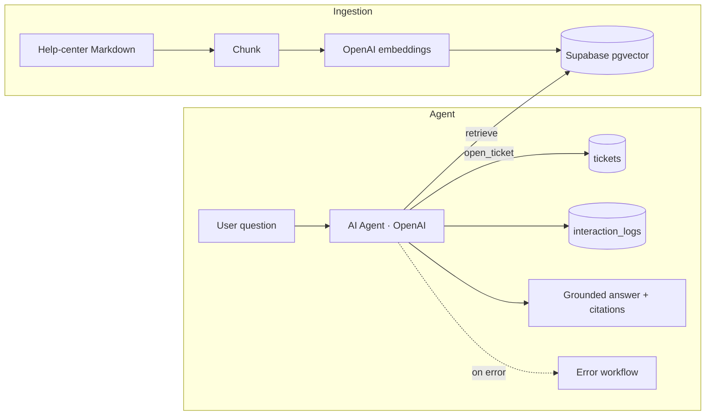

# Meridian Support Copilot

> An AI support agent that answers customer questions from Meridian's help center and opens a ticket for anything it can't resolve — grounded in RAG, with an eval harness that proves its accuracy.

<!-- HERO: input → grounded answer + auto-ticket, in ≤10s -->

▶ **Watch the 90-second walkthrough** _(link added when recorded)_

## Problem → Solution

**Problem.** Support teams drown in repetitive tier-1 questions ("how do I reset my password?", "what's your refund policy?"). Each one costs a human 5–10 minutes, and customers wait hours for answers that already exist in the docs.

**Solution.** A retrieval-augmented agent, orchestrated in n8n, that answers from Meridian's actual help center — with citations — and, when a request needs a human (refunds, ownership disputes), automatically opens a structured ticket instead of guessing.

**Outcome.** On the eval set the agent gives **grounded, cited answers in ~4 seconds and correctly escalates every case that needs a human — 10/10** — versus a multi-hour first response by hand.

> **About the scenario.** Built for **◆ Meridian**, a fictional B2B SaaS (project management + analytics) used to demonstrate production-grade automation in a realistic context. No real customer data.

## Architecture

Full walkthrough: [`docs/ARCHITECTURE.md`](docs/ARCHITECTURE.md).

## Engineering

What makes this production-grade, not a demo:

- **Reliability** — dedicated Error Trigger workflow; the `open_ticket` tool uses an idempotency key (`external_ref`) so a retried run never creates duplicate tickets.
- **Observability** — every interaction (question, answer, retrieved doc ids, latency, token usage, resolved/escalated) is written to `interaction_logs` and inspectable in n8n's execution history.
- **Correctness** — a versioned eval set (`/eval`) runs the agent over labeled Q&A and scores grounding + escalation accuracy; the current number is reported in the Results section.
- **Cost control** — retrieval capped at top-5 chunks; embeddings generated once at ingestion, not per query; compact model for classification, larger only for generation.

Design decisions and trade-offs: [`docs/DECISIONS.md`](docs/DECISIONS.md).

## How it works

1. **Ingestion** chunks the help-center Markdown, embeds each chunk with OpenAI, and upserts it into Supabase (`kb_documents`).
2. A user question hits the agent (chat or webhook).
3. The **AI Agent** retrieves the most relevant chunks via `match_kb_documents` and answers **only** from that context, with citations.
4. If the request needs a human (e.g., a refund), the agent calls the **`open_ticket`** tool instead of answering, and tells the user a ticket was created.
5. The interaction is **logged** for observability and eval.

## Run it yourself

**Prerequisites:** an n8n instance (Cloud or self-hosted), a Supabase project with `pgvector`, and an OpenAI API key.

1. Copy `.env.example` to `.env` and fill in the values.
2. Apply the database schema in [`docs/ARCHITECTURE.md`](docs/ARCHITECTURE.md) (Data model).
3. Import the workflows from `workflows/` into n8n.
4. Add an **OpenAI** credential and a **Supabase** credential in n8n.
5. Run **`meridian-kb-ingestion`** once to populate the vector store.
6. Open the **`meridian-support-copilot`** chat trigger and ask a question.

Detailed operations: [`docs/RUNBOOK.md`](docs/RUNBOOK.md).

## Results

Verified end-to-end on a live n8n Cloud + Supabase deployment:

| Behavior | Result |
|----------|--------|
| Grounded answer with citation ("API rate limits on Business?") | ✅ "3,000 requests/min… from *API keys and webhooks*" in ~4s |
| Escalation opens a ticket ("Can I get a refund?") | ✅ ticket created, `external_ref = jane@acme.com+refund`, priority high |
| Idempotency key on escalation | ✅ stable `external_ref` → unique constraint prevents duplicates |
| Every turn logged for observability | ✅ 3/3 interactions in `interaction_logs` (incl. a failed-retrieval case) |
| Knowledge base indexed | ✅ 12 chunks across 6 articles (1536-dim embeddings) |

**Eval harness ([`eval/`](eval/), run live on n8n):**

| Metric | Result |
|--------|--------|
| Overall accuracy | **10 / 10 (100%)** |
| Grounding (answer-from-KB, cited) | **8 / 8** |
| Escalation (opens a ticket) | **2 / 2** |

The eval workflow runs all 10 labeled cases through the agent and scores each automatically (see [`eval/README.md`](eval/README.md)).

## Stack & credits

- **Orchestration:** n8n
- **LLM + embeddings:** OpenAI (chat + `text-embedding-3-small`)
- **Data / vectors:** Supabase (Postgres + pgvector)

---

Maintained by **Augusto Henrique** — AI Automation Engineer · [github.com/augusto-hjs](https://github.com/augusto-hjs)

🇧🇷 Resumo em português

Agente de suporte com IA (RAG) que responde dúvidas de clientes a partir da central de ajuda da Meridian (empresa fictícia), com citações, e **abre um ticket automaticamente** quando o caso precisa de um humano (ex.: reembolso). Orquestrado em n8n, com embeddings e busca vetorial no Supabase (pgvector). Destaques de engenharia: workflow de erro dedicado, **idempotência** na criação de tickets, **observabilidade** (todas as interações logadas) e um **harness de avaliação** que mede a acurácia.

