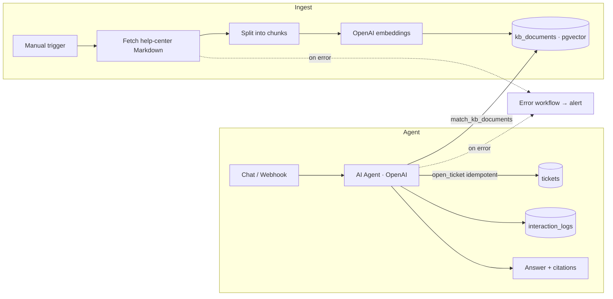

# Architecture — Meridian Support Copilot

## Overview

Two n8n workflows over a Supabase (pgvector) store. **Ingestion** turns the help-center Markdown into embedded chunks. The **Agent** answers questions strictly from retrieved context, escalates to a ticket when needed, and logs every interaction. An **Error** workflow catches failures in either.

## Diagram



## Data flow

| Step | Node / Component | Input | Output | Notes |
|------|------------------|-------|--------|-------|
| 1 | Fetch Markdown | manifest.json | raw articles | Source of truth = `knowledge-base/` |
| 2 | Split | article text | ~500-token chunks w/ overlap | Metadata: `{category, title, source}` |
| 3 | Embed | chunk text | vector(1536) | `text-embedding-3-small` |
| 4 | Upsert | vector + metadata | row in `kb_documents` | Re-runnable |
| 5 | Retrieve | question embedding | top-5 chunks | `match_kb_documents(query, 5, filter)` |
| 6 | Generate | question + chunks | grounded answer | System prompt forbids answering outside context |
| 7 | Escalate | intent = human-needed | row in `tickets` | Idempotency via `external_ref` |
| 8 | Log | full interaction | row in `interaction_logs` | Observability |

## Data model

```sql
create extension if not exists vector;

create table public.kb_documents (
  id uuid primary key default gen_random_uuid(),
  content text not null,
  metadata jsonb not null default '{}'::jsonb,
  embedding vector(1536),
  created_at timestamptz not null default now()
);

create function public.match_kb_documents(
  query_embedding vector(1536), match_count int default 5, filter jsonb default '{}'
) returns table (id uuid, content text, metadata jsonb, similarity float)
language plpgsql stable set search_path = '' as $$
begin
  return query
  select d.id, d.content, d.metadata, 1 - (d.embedding <=> query_embedding)
  from public.kb_documents d
  where d.metadata @> filter
  order by d.embedding <=> query_embedding
  limit match_count;
end; $$;

create table public.tickets (
  id bigint generated always as identity primary key,
  external_ref text unique,           -- idempotency key
  customer_email text, subject text not null, body text,
  status text not null default 'open', priority text not null default 'normal',
  created_at timestamptz not null default now()
);

create table public.interaction_logs (
  id bigint generated always as identity primary key,
  session_id text, question text, answer text,
  used_docs jsonb, latency_ms int, usage jsonb, resolved boolean,
  created_at timestamptz not null default now()
);
```

RLS is enabled on all three tables with no anon policies (deny-by-default); n8n connects with the service role key. See `DECISIONS.md` (ADR-003).

## Failure modes & handling

| Failure | Detection | Handling |
|---------|-----------|----------|
| OpenAI 429 / timeout | node error | n8n retry with backoff; Error workflow alerts if exhausted |
| No relevant chunk found | similarity below threshold | Agent says it can't answer and offers to open a ticket |
| Duplicate escalation on retry | same `external_ref` | Unique constraint → upsert no-ops, no duplicate ticket |
| Embedding drift after doc edit | re-run ingestion | Chunks re-embedded; ingestion is idempotent |

## Scaling & cost notes

- Embeddings computed once per chunk at ingestion, not per query.
- Retrieval capped at top-5 to bound prompt size and cost.
- `ivfflat` index (lists=100) keeps vector search fast at this corpus size; switch to `hnsw` if the corpus grows large.
